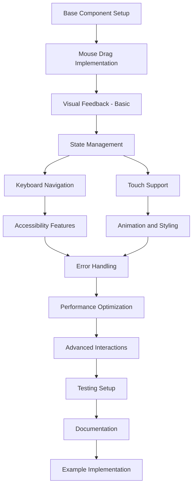

# Drag and Drop Implementation Tasks

## Phase 1: Core Functionality

### 1. Base Component Setup
- [ ] Create base component structure
- [ ] Set up TypeScript interfaces for props
- [ ] Implement basic component styling
- [ ] Add drag and drop context provider

### 2. Mouse Drag Implementation
- [ ] Implement drag start event handlers
- [ ] Add drag move logic
- [ ] Create drop zone detection
- [ ] Implement basic reordering logic

### 3. Visual Feedback - Basic
- [ ] Add dragging state styles
- [ ] Implement drop zone indicators
- [ ] Create drag preview
- [ ] Add cursor state changes

### 4. State Management
- [ ] Set up drag context
- [ ] Implement position tracking
- [ ] Add reorder callbacks
- [ ] Create state update optimizations

## Phase 2: Enhanced Features

### 5. Keyboard Navigation
- [ ] Implement focus management
- [ ] Add keyboard event handlers
- [ ] Create keyboard movement logic
- [ ] Implement keyboard state machine

### 6. Accessibility Features
- [ ] Add ARIA attributes
- [ ] Implement screen reader messages
- [ ] Create focus indicators
- [ ] Add audio feedback for actions

### 7. Touch Support
- [ ] Implement touch event handlers
- [ ] Add long press detection
- [ ] Create touch feedback
- [ ] Handle multi-touch scenarios

### 8. Animation and Styling
- [ ] Add smooth transition animations
- [ ] Implement drop zone highlighting
- [ ] Create drag preview animations
- [ ] Add theme support

## Phase 3: Advanced Features

### 9. Error Handling
- [ ] Implement boundary protection
- [ ] Add invalid operation handling
- [ ] Create error recovery logic
- [ ] Add user feedback for errors

### 10. Performance Optimization
- [ ] Implement render optimization
- [ ] Add memoization where needed
- [ ] Optimize drag preview
- [ ] Minimize layout shifts

### 11. Advanced Interactions
- [ ] Add drag constraints
- [ ] Implement custom drag handles
- [ ] Create nested drop zones
- [ ] Add direction constraints

### 12. Testing Setup
- [ ] Create unit test suite
- [ ] Implement integration tests
- [ ] Add accessibility tests
- [ ] Create performance tests

## Phase 4: Documentation and Examples

### 13. Documentation
- [ ] Create component API documentation
- [ ] Add usage examples
- [ ] Document keyboard shortcuts
- [ ] Create accessibility guide

### 14. Example Implementation
- [ ] Create basic list example
- [ ] Add complex nested example
- [ ] Create grid layout example
- [ ] Add custom styling example

## Task Dependencies

## Estimation (Story Points)

1. Base Component Setup (3)
2. Mouse Drag Implementation (5)
3. Visual Feedback - Basic (3)
4. State Management (5)
5. Keyboard Navigation (8)
6. Accessibility Features (8)
7. Touch Support (5)
8. Animation and Styling (5)
9. Error Handling (3)
10. Performance Optimization (5)
11. Advanced Interactions (8)
12. Testing Setup (8)
13. Documentation (3)
14. Example Implementation (3)

Total: 67 Story Points

## Success Criteria

- All unit tests passing
- Keyboard-only navigation works
- Screen reader compatibility verified
- Performance metrics met:
  - Drag initiation < 50ms
  - Animation smoothness > 55fps
  - No lag on reordering
- WCAG 2.1 AA compliance achieved
- Browser compatibility verified
- Touch devices supported
- Documentation complete

## Initial Focus Areas

1. Core drag and drop functionality
2. Basic accessibility features
3. Essential error handling
4. Key performance optimizations

This ensures we have a solid foundation before adding advanced features.
